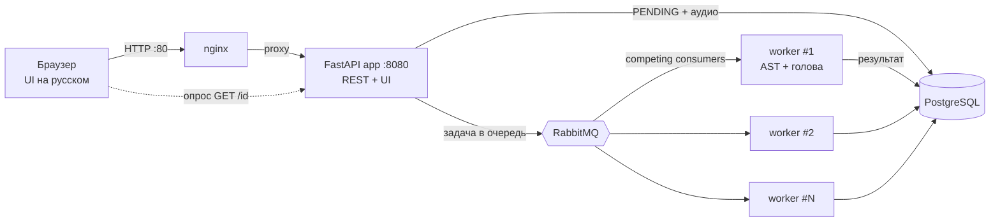

# 🐦 Определитель птиц по голосу — MVP

Веб-сервис, который по короткой аудиозаписи определяет вид птицы и показывает вероятность.
Региональный фокус — **топ-20 видов Санкт-Петербурга и Ленинградской области**. Без регистрации.

Модель: эмбеддинги **AST** (`MIT/ast-finetuned-audioset-10-10-0.4593`) + лёгкая голова
(`StandardScaler` + `LogisticRegression`, обучена на региональных данных). Предсказание по записи =
усреднение вероятностей по 5-секундным сегментам + порог уверенности.

---

## Возможности

- 📤 Загрузка готового аудиофайла (WAV / MP3 / M4A, до 15 МБ) — ключевая фича, которой нет у Merlin/BirdNET.
- 🇷🇺 Полностью русскоязычный интерфейс и названия видов.
- 🎯 Результат: вид, вероятность в %, топ-3 вида, фото и краткое описание.
- ⚡ Асинхронная обработка через очередь — UI не блокируется, воркеры масштабируются.
- 🔌 REST API с автодокументацией (Swagger / ReDoc).

---

## Архитектура



Поток: **загрузка → запись `PENDING` в БД + публикация задачи в RabbitMQ → воркер забирает задачу,
прогоняет модель, пишет результат в БД → UI опрашивает статус и показывает карточку вида.**

Несколько воркеров — *конкурирующие потребители* одной durable-очереди (`prefetch=1` + ручной `ack`):
задачи честно распределяются, при падении воркера задача не теряется.

---

## Доменная модель (основные сущности)

| Сущность | Назначение | Ключевые поля | Связи |
|---|---|---|---|
| **Species** (вид) | справочник 20 региональных видов | `name` (рус., = метка класса), `latin`, `description`, `photo_url`, `order_index` | 1 — N → PredictionScore |
| **Prediction** (запрос на определение) | загруженная запись и её обработка | `id` (uuid), `status` (PENDING/PROCESSING/DONE/FAILED), `audio_path`, `confidence`, `is_confident`, `top_species`, `duration_sec`, `processing_ms` | 1 — N → PredictionScore |
| **PredictionScore** (оценка по виду) | вероятности топ-N видов для записи | `probability`, `rank`, `species_name` | N — 1 → Prediction, → Species |

```
Species (1) ──< (N) PredictionScore (N) >── (1) Prediction
```

Код сущностей: [`common/models/`](common/models). B2B-расширения (организация, подписка, лимит «5 бесплатных
определений») в MVP сознательно не реализованы — авторизация конечного пользователя пока не нужна;
эти сущности добавляются поверх текущей схемы без её изменения.

---

## Технологии

FastAPI · SQLModel · PostgreSQL · RabbitMQ (pika) · PyTorch + Transformers (AST) · scikit-learn ·
librosa · Jinja2 + ванильный JS · nginx · Docker Compose · pytest.

---

## Модель

Состоит из двух частей:
- **Региональная «голова»** (`StandardScaler` + `LogisticRegression`) обучена на наших данных и лежит
  **прямо в репозитории**: `worker/models_store/ast_head.joblib` (~143 КБ) + `classes.json`.
- **Backbone AST** (`MIT/ast-finetuned-audioset-10-10-0.4593`, ~346 МБ) в репозитории не хранится —
  скачивается с HuggingFace автоматически при первом запуске воркера (нужен интернет, один раз).

Поэтому после `git clone` проект **воспроизводим у любого**: голова — в репозитории, backbone — из
HuggingFace, данные сервиса — в Docker-томах. Доступ к диску D автора или к MinIO для запуска сервиса **не нужен**.

---

## Быстрый старт (Docker)

> Требуется Docker Desktop. Работает на Windows / macOS / Linux: данные хранятся в именованных
> Docker-томах, привязки к конкретному диску или букве нет.

```powershell
cd deploy
copy .env.example .env          # Linux/macOS: cp .env.example .env

docker compose up -d --build    # поднять весь стек
```

Откройте **http://localhost** — это UI. Swagger: **http://localhost/api/docs**.
Консоль RabbitMQ: **http://localhost:15672** (логин/пароль из `.env`).

При первом старте воркер один раз скачивает backbone AST с HuggingFace (~346 МБ) в том `hf_cache`
(нужен интернет). Прогресс: `docker compose logs -f worker`.

Остановить: `docker compose down` (данные в томах сохраняются; стираются только при `docker compose down -v`).

### Где хранятся данные и как держать их на диске D
По умолчанию БД, очередь, кэш модели и загруженные аудио лежат в именованных Docker-томах
(`postgres_data`, `rabbitmq_data`, `hf_cache`, `uploads`) — кроссплатформенно, путь указывать не нужно.
Чтобы всё физически было на **диске D**: Docker Desktop → **Settings → Resources → Advanced →
Disk image location → `D:\DockerData`** (разово; туда уедут и образы, и тома).

---

## Масштабирование воркеров с моделью

Главное требование задания — горизонтальное масштабирование модели. Делается одной командой:

```powershell
docker compose up -d --scale worker=3
```

Поднимутся 3 одинаковых воркера, подключённых к одной очереди. RabbitMQ распределяет задачи между ними
(round-robin с `prefetch=1`). Проверить число потребителей очереди можно в консоли RabbitMQ
(http://localhost:15672 → Queues → `bird_predictions` → Consumers).

---

## REST API

| Метод | Путь | Описание |
|---|---|---|
| `POST` | `/api/predictions/` | Загрузить аудио (`multipart/form-data`, поле `file`) → создаёт запрос, отдаёт `{id, status}` |
| `GET` | `/api/predictions/{id}` | Статус и результат определения (вид, %, топ-3) |
| `GET` | `/api/predictions/` | История последних определений |
| `GET` | `/api/species/` | Справочник 20 видов |
| `GET` | `/health` | Healthcheck сервиса |
| `GET` | `/` | Веб-интерфейс |

Пример:

```bash
# поставить запись в очередь
curl -F "file=@bird.mp3" http://localhost/api/predictions/
# -> {"id":"a1b2...","status":"PENDING"}

# забрать результат
curl http://localhost/api/predictions/a1b2...
# -> {"status":"DONE","top_species":"Зяблик","confidence":0.81,"is_confident":true,"scores":[...]}
```

---

## Тесты

Покрыты критичные части: **логика инференса** (сегментация, агрегация, ранжирование, порог),
**REST-контракт** (загрузка → очередь → статус, валидация формата/размера) и **сидинг справочника**.
Тесты не требуют torch и RabbitMQ: ML-логика проверяется на чистых функциях с фейковой моделью,
API — с in-memory SQLite и подменённым издателем очереди.

```powershell
cd deploy
python -m venv .venv; .\.venv\Scripts\Activate.ps1
pip install -r requirements-dev.txt
pytest
```

---

## Структура проекта

```
deploy/
├── docker-compose.yaml      # db, rabbitmq, app, worker (масштабируемый), web(nginx)
├── .env.example             # настройки сервиса (БД, RabbitMQ, инференс)
├── nginx/nginx.conf
├── common/                  # общий код API и воркера
│   ├── config.py            # настройки (pydantic-settings)
│   ├── database.py          # движок, сессии, init_db
│   ├── mq.py                # параметры RabbitMQ
│   └── models/              # СУЩНОСТИ: Species, Prediction, PredictionScore
├── app/                     # API-шлюз + UI
│   ├── main.py              # FastAPI (startup: init_db + сидинг)
│   ├── routes/              # /api/predictions, /api/species, /, /health
│   ├── publisher.py         # издатель задач в RabbitMQ
│   ├── seed.py              # 20 видов
│   ├── view/ static/        # Jinja2-шаблон + CSS/JS/заглушка
│   └── Dockerfile
├── worker/                  # масштабируемый воркер с моделью
│   ├── inference.py         # AST + голова: сегментация, агрегация, порог
│   ├── worker.py            # потребитель RabbitMQ -> инференс -> БД
│   ├── models_store/        # ast_head.joblib + classes.json
│   └── Dockerfile           # torch (CPU) + ffmpeg
└── tests/                   # pytest: inference, api, seed
```

---

## Ограничения и заметки

- **Версия scikit-learn.** Голова `ast_head.joblib` обучалась в Colab. Если при загрузке появится ошибка
  несовместимости версий — подгоните версию в `worker/requirements.txt` под ту, что использовалась при обучении.
- **Фото видов.** В `app/static/species/` лежат реальные фото всех 20 видов (~3 МБ), скачанные с
  Wikipedia / Wikimedia Commons скриптом [`scripts/fetch_species_photos.py`](scripts/fetch_species_photos.py)
  (источники — в `app/static/species/CREDITS.md`, лицензии в основном CC BY-SA / Public Domain).
  SVG-заглушка остаётся фолбэком (`onerror`), если файл недоступен. Обновить фото — перезапустить скрипт.
- **Первый запуск воркера** дольше обычного: качается backbone AST (~346 МБ) в том `hf_cache`.
- **Точность.** По данным §4 ноутбука улучшения: при пороге τ=0.4 — точность ~92% при покрытии ~81%; порог
  настраивается через `CONFIDENCE_THRESHOLD` в `.env`.

## Данные и воспроизводимость (DVC + MinIO)

Обучающий датасет голосов хранится не в Git, а в объектном хранилище **MinIO** и
версионируется через **DVC** — в репозитории лежит только указатель `data/audio.dvc`.

- Remote `minio-storage`: бакет `s3://anna-kulakova-tcn7847`,
  endpoint `https://s3.lab.karpov.courses` (S3-совместимый MinIO).
- Датасет `data/audio/<Вид>/<файлы>`: **190 записей, ~1.0 ГБ**.
- Получить данные локально / в Colab:

      dvc pull data/audio.dvc

**Разделение хранилищ в проекте:**
- **MinIO (через DVC)** — версионирование *датасета обучения* (воспроизводимость: датасет → обучение головы в Colab).
- **PostgreSQL** — *результаты сервиса* (история определений и оценки по видам).
- **Docker-тома** (`postgres_data`, `rabbitmq_data`, `hf_cache`, `uploads`) — БД, RabbitMQ, кэш модели, загруженные аудио (по умолчанию управляются Docker; при желании — на диске D).

Развёрнутый сервис **не обращается к MinIO в рантайме**: в прод уезжает только лёгкая
голова `ast_head.joblib` + `classes.json`, а backbone AST подтягивается с HuggingFace.
